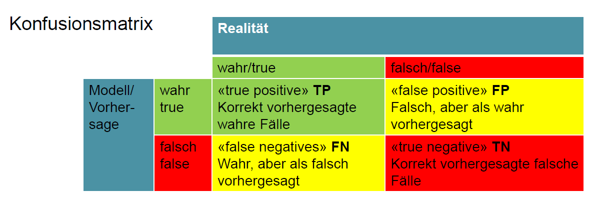
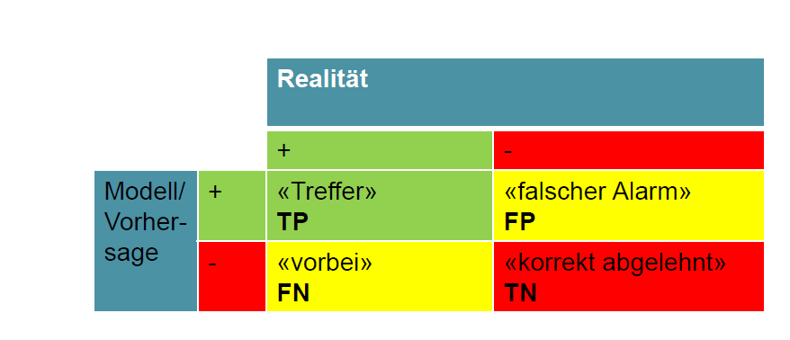

---
titlepage: true
titlepage-color: "ffffff"
titlepage-rule-color: "ffffff"
titlepage-text-color: "000000"
toc-own-page: true
colorlinks: false
title: Prüfungsvorbereitung Text Analytics 
author:
- Yannick Hutter 
lang: de
date: "29.01.2024"
lof: true
mainfont: Liberation Sans
sansfont: Liberation Sans
monofont: JetBrains Mono
header-left: "\\small \\thetitle"
header-center: "\\small \\leftmark"
header-right: "\\small \\theauthor"
footer-left: "\\leftmark"
footer-center: ""
footer-right: "\\small Seite \\thepage"
...

\newpage

# Natural Language Processing (NLP)
Menschen lernen Sprachen anhand von zwei Prinzipien, worauf auch viele Verfahren von NLP basieren:

* Durch Nachahmung und Wiederholung (Behavioristischer Ansatz nach Skinner)
* Durch vorgegebene kognitive Fertigkeiten wie die Fähigkeit zur Kategorisierung, Vereinheitlichung und Übertragung (Nach Chomsky)

Im Rahmen von NLP wird zwischen der **geschriebenen** und **gesprochenen** Sprache unterschieden, wobei der Hauptfokus auf der **geschriebenen Sprache** liegt. Der Begriff **Natural** bezeichnet hier die durch menschliche Interaktion gemachte Sprache. NLP wird unter anderem in folgenden **Anwendungsfeldern** eingesetzt:

* Übersetzungen - Machine Translation
* Spracherkennung
* Automatisches Textzusammenfassung
* Textgenerierung
* Textanalyse (Klassifikation, Ähnlichkeitsanalyse, Entity Extraction)

Wichtig ist auch die **Unterscheidung zwischen Semantik und Syntax**.

> **Semantik**: Definiert die eigentliche Bedeutung der Wörter und Sätze

> **Syntax**: Definiert die Einordnung und Struktur. Versucht Sätze, Phrasen und Wörter zu kategorisieren. Oftmals wird hierbei hierarchisch Strukturiert bspw. nach Satz, Satzteil, Phrase oder Wort.


## POS Tagging
Mithilfe von Bibliotheken wie `nlp` können Wörter und Satzteile genauer bestimmt werden. Dies geschieht über das sogenannnte **POS-Tagging**.

|Wortart (Abkürzung)|Erklärung|Beispiel|
|---|------|---|
|Adjektiv (ADJ/JJ)|Beschreibung anderer Wörter genauer|faul, aufmerksam|
|Adverb (ADV/RB)|Modifiziert oder beschreibt andere Wörter|Ich gehe **gerne** in die Vorlesung|
|Pronomen (PR)|Verweist auf etwas|er, mein, welcher|
|Präposition (IN)|kurzes Wort, welches sich auf ein Nomen oder Pronomen bezieht|anhand, dank, trotz|

Aus diesen Wortarten lassen sich wiederum ganze Sätze bilden

|Satz (Abkürzung)|Erklärung|Beispiel|
|---|------|---|
|Nominalphrase (NP)|Nomen ist Hauptwort|Der faule Hund|
|Verbalphrase (VP)|Verb ist Hauptwort|Das Bild **gefällt mir sehr**|
|Adjektivphrase (ADJP)|Hauptwort ist Adjektiv|Die sehr schnelle Katze ("sehr schnelle" ist ADJP (eingeschachtelt))|
|Adverbialphrase (ADVP)|Hauptwort ist Adverb|NLP ist **sehr interessant**|
|Präpositionalphrase (PP)|Präposition als Hauptwort|Eine Frau steht **auf einer Leiter**.|

## Darstellung von Grammatiken
Mithilfe der **Dependenzengrammatik** können Abhängigkeiten zwischen Wörtern aufgezeigt werden:

* Eins-zu-eins Beziehungen: ein Wort hängt von einem anderen Wort ab
* Ein "Hauptwort" oder eine Wurzel (root) hat keine weiteren Abhängigkeiten im Satz.


Die **Konstituentengrammatik** gehen von Wort-übergreifenden Strukturen aus, die hierarchisch zusammengesetzte Sätze bilden:

* Wörter gehören zu syntaktischen Kategorien
* Wörter bilden den Kopf (Hauptwort) von Phrasen.
* Zusammensetzung von Sätzen anhand von Phrasenstrukturregeln

Somit können **Ableitungsregeln** zur Generierung von gültigen Sätzen hergeleitet werden.

```text
S -> NP [VP]
NP -> [DET] [ADJ] N [PP]
VP -> V
```

## Sprachklassifikation

> Wortordnung bzw. Wortreihenfolge im Satz eignet sich zur Klassifikation von Sprachen und Sprachfamilien

## Reguläre Ausdrücke
Reguläre Ausdrücke sind Kurzschreibweisen für String-Muster, bspw. zum Suchen oder Ersetzen.

|Ausdruck|Bedeutung|
|---|------|
|Punkt (.)|steht für ein einzelnes (beliebiges) Zeichen|
|Dach (^)|steht für den Anfang eines Strings|
|Dollar ($)|steht für das Ende eines Strings|
|Stern (*)|steht für beliebig viele (auch null) Wiederholungen des Zeichens oder des Musters direkt vor dem Stern|
|Fragezeichen (?)|steht für null oder ein Zeichen oder Muster|
|Plus (+)|steht für eins oder mehrere|
|Eckige Klammern ([ ])|steht für eine Alternativauswahl der in den Klammern aufgeführten Zeichen|
|Dach in eckige Klammern ([^])|negiert die Auswahl|
|Strich (|)|ist eine Oder-Auswahl (davor oder danach)|
|\d|für Dezimalziffern, also [0123456789] oder [0-9]|
|\D|für nicht-Dezimalziffern also [^0-9]|
|\s|für whitespace|
|\S|für nicht-Whitespace|
|\w|für alphanumerische Zeichen, also [a-zA-Z0-9_]|
|\W|für nicht-alphanumerische Zeichen|

## Beispiel für Reguläre Ausdrücke

**Regulärer Ausdruck zur Entfernung von Sonderzeichen**

```regex
[^a-zA-z0-9\s]
```


# Vorverarbeitung von Texten
Damit die Texte effektiv genutzt werden können sind noch ein paar Vorverarbeitungsschritte notwendig:

* Texte, Sätze und Wörter trennen (Tokenization)
* Texte bereinigen (Removal, Conversions, Corrections)
* Wörter auf Grundformen bringen (Stemming, Lemmatization)

## Tokenizer

* Sentence Tokenizer teilt Texte in Sätze auf, siehe *PunktSentenceTokenizer* aus nltk
* Word Tokenizer teilt Texte oder Sätze in Wörter auf, siehe *TokTokTokenizer*, *RegexpTokenizer* aus nltk

Der **Sentence Tokenizer** teilt den Text nach folgenden Kriterien auf:

* Punkt
* Neuer Absatz
* Ausrufezeichen

Der **Word Tokenizer** Teilt Texte oder Sätze in einzelne Wörter auf.

## Normalisierung
Folgende Aspekte sollten (abhängig von der Sprache) normalisiert werden:

* Akzente und Umlaute
* Abkürzungen, Wortzusammenziehungen
* Sonderzeichen
* Schreibkorrektur/Rechtschreibung

## Auslassung und Contractions
Auch kann es sinnvoll sein gewisse Wörter komplett zu **ignorieren** oder Rückübersetzungen bspw. über Übersetzungstabellen zu machen:

* Is not --> isn't
* Do not don't

## Gross- und Kleinschreibung
Kann mithilfe von Python Bordmitteln wie `lower(), upper() und title()` gelöst werden


# Rechtschreibkorrekturen
Die Idee hinter der Rechtschreibkorrektur ist es, dass:

* Umfangreiche Wortliste (freie Quellen) zur Verfügung steht
* Jedes Wort mit der Wortliste abgeglichen wird
* Falls das Wort nicht gefunden werden kann, wird dieses abgeändert und es wird erneut nach dem (abgeänderten) Wort gesucht
* Distanzmass/Vergleichsmassstab: **Editierdistanz (edit distance)**

Abhängig von der Editierdistanz kann es **mehrere richtige Kandidaten pro Stufe geben**. Die Lösung dieser Problematik ist die **Worthäufigkeit**.

## Editierdistanzen
Eine Editierdistanz ist durch die **Anzahl der Transformationen** definiert. Beispiele für die **Editierdistanz 1** können beispielsweise sein:

* Einfügen von Buchstaben
* Löschen von Buchstaben
* Ersetzen von Buchstaben
* Ändern der Buchstabenreihenfolge (Nachbarvertauschungen)

> Als Rückfalloption kann das Wort selbst genommen werden

# Stammformenreduktion
Die Stammformenreduktion führt **Wortformen auf einen gemeinsamen Wortstamm zurück**. Dies wird beispielsweise in *Suchmaschinen*, *Clusterbildung* und in der *Klassifikation* eingesetzt.

Die Stammformenreduktion (stemming) arbeitet nach einem *regelbasierten Verfahren*. Es gibt jedoch auch Verfahren welche auf Basis von *Wortlisten* und *Statistiken* arbeiten.

# Lemmatisierung
Die Lemmatisierung ist ebenfalls **eine Rückführung auf die Grundform**. Es gibt jedoch einige wichtige **Unterschiede zur Stammformenreduktion**:

* Die Lemmatisierung geht nach Wortform anstelle des Wortstamms (Lexikon oder Wörterbucheintrag)
* Die Lemmatisierung ist immer Wörterbuchbasiert
* Stemming kann schneller sein, wenn es regelbasiert arbeitet

# Stoppwörter
Die Idee ist, dass gewisse "Füllwörter" entfernt werden. Dies kann jedoch heikel sein, da dadurch **potenziell wichige Information verloren geht**. Das Entfernen von Stoppwörtern ist vorallem für **statistische Analysen** wie bspw. Worthäufigkeiten, Klassifikationen und Clustering interessant.

# Wortartenerkennung

> Tagger basierend auf Machine Learning

Wortarten können mithilfe von **NLTK-Taggern** erkannt werden:

* Default-Tagger - Alles auf einen Fall abbilden
* Regulärer Ausdruck - Alles auf Muster abbilden
* N-gram Tagger
    * Unigram - Jedes Wort betrachten 
    * Bigram und Trigram - Alle Wortkombinationen

Meistens werden eine oder mehrere Tagger hierzu kombiniert. Die Parser werden auf Trainingsdaten aus einem annotierten Korpus (POS- und Chunk-Tags) trainiert. Weitere Teile des Korpus (Testdaten) können zur Bestimmung der Genauigkeit verwendet werden.

# Shallow Parsing
Das Shallow Parsing kann zur **flachen Syntaxanalyse** genutzt werden. Hierzu werden **Sätze zu zusammenhängende Phrasen** konvertiert. Wichtig zu verstehen ist dass **keine detaillierte syntaktische Analyse innerhalb der Phrasen** erfolgt. Es stehen folgende Verfahren zur Auswahl:

* Parsing mit regulären Ausdrücken (auf Wörtern und Tags)
* Chunking - Sinnvolle Phrasen oder Wortgruppen in einem Satz zu identifizieren (NP, VP etc.)
* Chinking - Erweiterung von Chunking bei dem gewisse Attribute (bspw. Adjektive) aus einem Chunk ausgeschlossen werden, bzw. als Ausschlusskriterium für den gesamten Chunk gelten.

## Chunks
Chunks werden mit sogennanten Chunk-Tags gekennzeichnet. Aus Listen mit Worten und Chunk-Tags können Parse-Bäume aufgebaut werden:

* B (begin)
* I (Inside)
* O (outside)

# Konfusionsmatrix
Die Konfusionsmatrix sagt voraus wie gut ein trainiertes Modell die Realität abbilden kann.



Hierzu gibt es folgende wichtige Berechnungsformeln



**Genauigkeit/Accuracy**

$$ \dfrac{TP + TN}{TP + FP + TN + FN} $$


**Precision**

Anteil der korrekt als wahr vorhergesagten Fälle.

$$ \dfrac{TP}{TP + FP} $$

**Sensitivität/Recall**

Anteil der korrekt vorhergesagten wahren Fälle

$$ \dfrac{TP}{TP + FN} $$

**F1**

Kombination von Precision und Recall, d.h. harmonisches Mittel aus Precision und Recall

$$ \dfrac{2 * Precision * Recall}{Precision + Recall} $$

# Dependency Parsing
Geht über das Shallow Parsing hinaus, **es werden alle Wörter miteinander in Beziehung gesetzt**, d.h. Wörter **hängen voneinander ab**:

* Es entsteht ein gerichteter Graph
* Wort ohne weitere Abhängigkeiten ist die Wurzel des Satzes und der Ausgangspunkt für eine Verwendung

# Constituency Parsing
Auch bekannt unter dem Begriff *Kontextfreie Grammatik*. Teilt den Text in seine **Bestandteile auf**. Ein Text kann so beispielsweise nach NP, VP etc. aufgeteilt werden.

# Feature Engineering
Die meisten Machine- und Deep-Learning Verfahren können Texte nicht direkt sondern benötigen eine **numerische Repräsentation**. Hierzu gibt es verschiedene Ansätze:

* Bag of Words
* Bag of N-Grams
* TF-IDF
* Word2Vec

## Vektorraum
Die Dimensionalität des Vektorraums entspricht der Anzahl **unterschiedlicher Wörter**:

* $VR = {W_1, W_2, ..., W_n}$ für n unterschiedliche Wörter
* Ein Dokument / Satz entspricht dann einem Vektor $D=(W_{D1}, W_{D2}, W_{Dn})$ wobei $W_{Di}$ jeweils das Gewicht des Wortes $i$ repräsentiert


## Bag of Words
Ein **Bag of Words** stellt die Wörter als eine Ansammlung von Zahlen dar und zählt dere Häufigkeit. Hierzu ein Beispiel:

* Wörter: Ich, nicht, liebe, mag, EDA, NLP
* VR={"Ich", "nicht", "liebe", "mag", "EDA", "NLP"}
* Dokument (Satz): Ich mag NLP.
* D = (1, 0, 0, 1, 0, 1)

Es gibt jedoch auch Probleme/Einschränkungen:

* Einige Wörter kommen öfters vor als andere (Domänenabhängig)
* Keine Stopp-Wörter
* Kontext geht verloren
* dünnbesetzte Vektoren/Vektorräume

Die Lösung hierzu ist eine **Normalisierung mit der relativen Häufigkeit**.

## TF-IDF
TF-IDF ist ein Verfahren welches zur Normalisierung der Worthäufigkeiten eingesetzt werden kann. TF bezeichnet hierbei die **Term Frequency** (Worthäufigkeit) und IDF die **Inverse Term Frequency** (Spezifität eines Wortes)

* tf = Anzahl Vorkommnisse eines Wortes in einem Dokument
* idf = Anzahl Dokumente / Anzahl Dokumente in denen w vorkommt

$$tf * idf $$

$$ idf = 1 + log \dfrac{N}{1 + df(w)} $$

Die **Vorteile** von TF-IDF sind:

* löst das Worthäufigkeitsproblem
* einfach umzusetzen
* vielseitig einsetzbar

Jedoch bietet TF-IDF auch gewisse **Nachteile**:

* Kontext geht verloren
* dünn besetzte Vektoren/Vektorräume

## Ähnlichkeit in Dokumenten
Die Ähnlichkeit von Dokumenten kann anhand ihrer Wortvektoren berechnet werden. **Viele Übereinstimmungen = Hohe Ähnlichkeit**.

Als Berechnungsgrundlagen kann beispielsweise der **Abstand** oder der **Winkel** genutzt werden. **Anwendungsfelder** für Dokumentenähnlichkeit sind beispielsweise:

* Suchmaschinen
* Cluster von Dokumenten
* Information Retrieval

## Dokumentenclustering

Clustering ist ein Beispiel für **unsupervised Learning** und damit zur Analyse von grossen Textdateien geeignet.

* Dokumente starten in einem eigenen Cluster
* Ähnliche Cluster werden zusammengelegt
* Cluster wachsen somit über die Zeit
* Endzustand - Alle Daten in einem Cluster, Schranke/Obergrenze beendet das Clustern

Cluster können beispielweise **anhand von folgenden Kriterien** erzeugt werden:

* Single-Link - Einzelne Elemente (jeweils ähnlichste Elemente)
* Complete-Link - Einzelne Elemente (jeweils unähnlichste Elemente)
* Average-Link - Mittelwert der Ähnlichkeiten

# Textklassifikation
Um Texte klassifizieren zu können sind folgende Informationen notwendig:

* Korpus/Dokumente
* Vordefinierte Klassen
* Supervised benötigt annotierte Daten
* Unsupervised kann mittels Clustering durchgeführt werden

Für eine Textklassifikation gibt es folgende **Varianten**:

* Binäre Klassifikation (SPAM/HAM)
* Multi-class/multinomial bspw. Kategorien für Schlagzeilen
* Multi-label - Mehr als eine gültige Klassifikation möglich

## Schritte für die Textklassifikation
Um eine Textklassifikation durchführen zu können sind folgende Schritte notwendig:

* Daten bereitstellen
* Datensatz aufteilen in Trainings- und Testdaten
* Datensatz aufbereiten und normalisieren
* Feature extraction, feature engineering (BOW)
* Trainieren des Modells/Klassifiers (Hyperparameter Tuning)
* Vorhersage und Evaluation

## Modelle für Textklassifikation
Folgende Modelle werden oft für die Textklassifikation verwendet:

* (Multinomial) Naive Bayes
* Logistic Regression
* Support Vector Machines

**Naive Bayes**

Basiert meist auf Bag-of-Words oder auch tf-idf Verfahren.

* Naive: Features sind unabhängig (als Annahme)
* Einfach/schnell zu trainieren
* Nicht viele Trainingsdaten notwendig
* Oft schlechter mit steigender Feature-Anzahl
* Multinomial: Einteilung in mehr als zwei Klassen

**Logistic Regression**

Erweiterung der klassische Regression auf diskrete Vorhersagen.

* Mehrere Features und Klassen möglich
* Schätzung der Modellparameter mittels Optimierung (Maximum Likelihood Estimation, MLE)
* Berechnung der Klassen-Wahrscheinlichkeit über logistische Funktion

**Support Vector Machines (SVM)**

* Trennung von Objekten anhand Hyperebenen
* Berechnung der Hyperebenen anhand von Stützvektoren (support vector) zu benachbarten Datenpunkten/Datenvektoren

**Random Forest**

Random Forest sind Entscheidungsbäume bzw. Decision Trees. Die Schrittweise Aufteilung der Datenpunkte erfolgt hierbei nach Features. Dasjenige Feature mit dem höchsten Informationsgewinn gewinnt.
Das Problem bei Random Forest ist jedoch, dass sie zu *Overfitting (Überanpassung)* neigen. Um diesem Problem entegegenzuwirken können folgende Schritte durchgeführt werden:

* Aufteilung der Daten
* Parallelles Training mehrerer Entscheidungsbäume mit Zufallsfaktoren
* Durchschnitt der Entscheidungen der Einzelbäume

## Model Tuning
Grundsätzlich können entweder Verbesserungen **an den Daten selbst** oder **am Modell** vorgenommen werden.
Bei den **Verbesserungen an den Daten** bestehen folgende Möglichkeiten:

* Mehr/andere Daten
* Besseres Cleaning
* Datenaufteilung
* Andere Features (BoW, TF-IDF)

**Verbesserungen am Modell** können **mittels Hyperparameter Tuning** erreicht werden. Diese sind Datenunabhängig aber je nach Modell unterschiedlich.

## Hyperparameter Tuning
Der Hyperparameter-Raum bezeichnet alle Einstellmöglichkeiten eines Modells. Um eine einfache Durchführung zu erreichen sind die Einstellmöglichkeiten oft in **Pipelines** zusammengefasst.

# Advanced Feature Engineering
Mit vielen Methoden und Anwendungsfällen besteht dass Problem, dass **der Kontext verloren geht**. Um diesem Umstand entgegenzuwirken, können **Wortvektoren** eingesetzt werden.

## Wortvektoren
Wortvektoren bieten folgende Vorteile:

* Kontext bleibt erhalten - Bedeutung (Semantik) des Wortes ergibt sich aus dem Vektor
* Kompakte Vektordarstellung
* Einfache Berechnung komplexer Sachverhalte

### Erzeugen von Wortvektoren
Wortvektoren können mit **folgenden Mitteln erzeugt werden**:

* Idee: Vorhersagen (prediction) statt Zählen
* Unüberwachtes Lernen (Neuronales Netz)
* Gewichte des trainierten Netzes bilden die Wortvektoren
* Grosser Korpus erforderlich

### Trainieren von Wortvektoren
In der Praxis können oft vortrainierte Modelle verwendet werden:

**Skip-gram**

* Vorhersage des Kontexts für ein Wort
* Ein Eingabewort – mehrere Ausgabewörter

**Continous-bag-of-words**

* Vorhersage eines Wortes aus dem Kontext
* Mehrere Eingabewörter – ein Ausgabewort

## Skip-Gram
Beim Skip-Gram sollen anhand eines **Input Worts** die **umgebenen Wörter vorausgesagt** werden. Hierbei werden die Eingabegewichte als Vektorrepräsentation für die Wörter verwendeten:

* Radius wählen (z.B. 2, also 2 Wörter davor und danach)
* Sätze aufteilen in 5-Gramme mit Lücke (skip)
* Neuronales Netz aufbauen mit Dimension m x n x m (m = Anzahl Wörter im Korpus) (n = Anzahl Dimensionen der Wortrepräsentation)
* Netz trainieren mit one-hot-encoding des jeweiligen Eingabewortes
* Bei Radius 2 also 4 Durchläufe (2 Wörter davor und 2 danach) pro 5-Gram

Das Skip-Gram bietet im Vergleich zum Contious Bag of Words folgende Vorteile:

* Besser für kleine Korpora und seltene Wörter
* Mehr Trainingsinput
* Höherer Trainingsaufwand

## Continous Bag of Words
Besitzt einen ähnlichen Aufbau wie das Skip-Gram jedoch:

* Eingabe ist multi-hot-Vektor der Umgebung, d.h. Summe der one-hot-Vektoren

Das CBOW bietet im Vergleich zum Skip-Gram folgende Vorteile:

* Bessere Genauigkeit für häufige Wörter
* Schneller zu trainieren

# Large Language Models
Die aktuell **beste Lösung für NLP** sind LLMs:

* Beliebige Distanzen in der Eingabe
* Parallelisierbarkeit im Training

# Named Entity Recognition (NER)
Named Entity Recognition wird eingesetzt um **bekannte Elemente** im Text zu erkennen:

* Personen
* Gebäude
* Orte/Länder

Das Ziel von NER ist es die **Semantik des Textes zu analyisieren**.

NER kann auch **selbst implementiert werden** mithilfe eines annotierten Korpus. Hierbei werden die IOB-Tags verwendet:

* B – Beginning of Tag
* I – Inside Tag (zusammengesetzte Wörter)
* O – outside Tag (kein NE)

# Sentiment Analyse
Die Sentiment Analyse erlaubt es die **Stimmungslage eines Textes** zu erkennen. Dies ist ein wichtiges Analyseziel in unterschiedlichen Bereichen:

* Schlagzeilen/Artikel
* Kommentare
* Reviews

Das gewünschte Ergebnis aus der Sentimenanalyse ist ein **Sentiment-Wert oft im Bereich von -1 bis 1**.


## Methoden
Für die Sentimen Analyse stehen folgende Methoden zur Verfügung:

* Unsupervised - Lexikon-basiert
* Supervised - Machine Learning
* Supervised - Deep Learning

## Lexikon-basierter Ansatz
Die Idee ist, dass Sentiment mit bestimmten Wörtern und Wortkombinationen ausgedrückt wird. Relevante Wörter werden mit allen nötigen Daten in einem Lexikon vorgehalten:

* Sentiment (positiv, neutral, negativ)
* Polarität (Stärke des Sentiments bzw. der Emotion: [-1,1]) – kontinuierlicher Sentiment-Wert
* POS, weitere Daten

> Für neue Texte kann auf diese Daten zurückgegriffen werden, um das Sentiment zu berechnen

Es gibt hierzu verschiedene Modelle:

* AFINN (Wortbasiert)
* SentiWordNet (Wortbasiert)
* VADER (Wortbasiert mit Regeln)

Eignung eines Ansatzes/Lexikons ist domänenabhängig und muss daher ausprobiert werden

## Supervised Learning
Supervised Learning erfodert andere Vorbereitugsschritte, da mit Zahlen und Vektoren gearbeitet werden muss:

* Word2Vec/gensim – trainiert auf den Daten
* GloVe – vortrainiertes Verfahren

Die oben genannten Verfahren erzeugen **dichtere Vektoren als BoW/TF-IDF**. Zur Erzeugung werden Neuronale Netze trainiert, die Wörter aus ihrem Kontext korrekt vorhersagen

> Laufzeiten können teilweise sehr lange sein


# Mögliche Prüfungsfragen

> Warum wird als Winkelmass für die Dokumentenähnlichkeit der Cosinuswinkel verwendet

* Numerisch stabil, welcher auch bei grossen Vektoren gut funktioniert
* Cosinus-Ähnlichkeit ist unempfindlich gegenüber der Länge der Dokumente

> Was ist der Vorteil von Bi-Grammen und Tri-Grammen?

* Reihenfolge spielt eine Rolle "brown fox" statt "fox brown"
* Kontext wird beibehalten (teilweise)

> Welche Möglichkeiten gibt es zur Behandlung von Zeichenwiederholungen

* Auffinden über Regex (Reguläre Ausdrücke)
* Reduktion, bis im Wörterbuch bekanntes Wort erreicht wird

> Warum ist es wichtig Strukturen in Texten zu erkennen?

Tiefergehende Textanalysen erfordern Kenntnis der Struktur eines Textes. Beispiele hierfür sind *Textklassifikationen* oder *Zusammenfassung und Themenfindungen*.

> Zu NLP gehören die Begriffe Syntax und Semantik. Erläutern sie kurz den Unterschied der Begriffe in der Sprachverarbeitung.

* **Semantik**: Definiert die eigentliche Bedeutung der Wörter und Sätze

* **Syntax**: Definiert die Einordnung und Struktur. Versucht Sätze, Phrasen und Wörter zu kategorisieren. Oftmals wird hierbei hierarchisch Strukturiert bspw. nach Satz, Satzteil, Phrase oder Wort.


> Um welches der beiden Gebiete Syntax und Semantik haben wir uns in der Vorlesung NLP mehr gekümmert und warum?

Wir haben uns mehr um die Thematik Syntax gekümmert. Die Semantik erlaubt Deduktionen, also Ableitungen weiterer Fakten und
Schlussfolgerungen, was nicht Hauptfokus der Veranstaltung war. Die Syntax Erlaubt es uns den Text zu Strukturieren und zu kategorisieren, was eine Textklassifikation etc. erlaubt.

> Welche Verfahren für das PoS-Tagging haben wir kennengelernt? Was sind die jeweiligen Vor- und Nachteile?

Im Rahmen von POS-Tagging haben wir die **Dependenzengrammatik** kennengelernt:

* + Erkennung von Abhängigkeiten
* + Besseres Verständnis der syntaktischen Struktur
* - Anfälligkeit für Fehler wenn die Wortreihenfolge stark varriiert

Nebst der Dependenzengrammtik gibt es auch ein **regelbasiertes Verfahren mit der Konstituentengrammatik**:

* + Robustheit bei Wortreihenfolge, da sie sich auf die Identifikation der einzelnen Bestandteile und weniger auf die Anordnung fokussiert
* + Erlaubt das Herleiten von Ableitungsregeln zur Generierung von gültigen Sätzen.
* - Grammatikregeln können sehr komplex werden 

> Ein sehr einfaches Verfahren für das PoS-Tagging ist die Verwendung von regulären Ausdrücken (regex). Damit können bestimmte Worteigenschaften auf PoS-Tags abgebildet werden. Ist die Verwendung eines so einfachen Verfahrens überhaupt sinnvoll? (Kurze Begründung erforderlich.)

Grundsätzlich kann die Verwendung eines rein regexbasierten Taggers zielführend sein. Er arbeitet jedoch nur auf dem Prinzip der Mustererkennung. Oft werden mehrere Tagger miteinander kombiniert, bspw. Regex + Unigram Tagger.