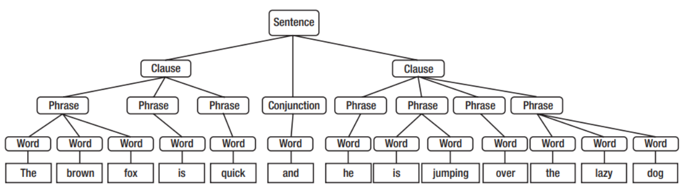
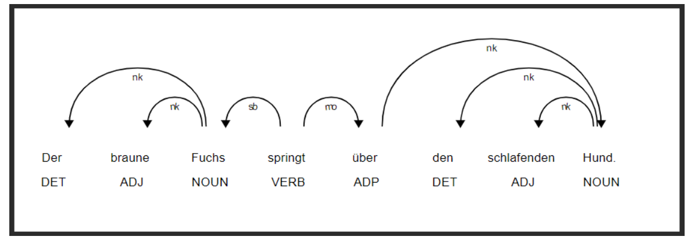

---
titlepage: true
titlepage-color: "ffffff"
titlepage-rule-color: "ffffff"
titlepage-text-color: "000000"
toc-own-page: true
colorlinks: false
title: Prüfungsvorbereitung Text Analytics 
author:
- Yannick Hutter 
lang: de
date: "29.01.2024"
lof: true
mainfont: Liberation Sans
sansfont: Liberation Sans
monofont: JetBrains Mono
header-left: "\\small \\thetitle"
header-center: "\\small \\leftmark"
header-right: "\\small \\theauthor"
footer-left: "\\leftmark"
footer-center: ""
footer-right: "\\small Seite \\thepage"
...

\newpage
# Theorie

## Natural Language Processing (NLP)
Menschen lernen Sprachen anhand von zwei Prinzipien, worauf auch viele Verfahren von NLP basieren:

* Durch Nachahmung und Wiederholung (Behavioristischer Ansatz nach Skinner)
* Durch vorgegebene kognitive Fertigkeiten wie die Fähigkeit zur Kategorisierung, Vereinheitlichung und Übertragung (Nach Chomsky)

Im Rahmen von NLP wird zwischen der **geschriebenen** und **gesprochenen** Sprache unterschieden, wobei der Hauptfokus auf der **geschriebenen Sprache** liegt. Der Begriff **Natural** bezeichnet hier die durch menschliche Interaktion gemachte Sprache. NLP wird unter anderem in folgenden **Anwendungsfeldern** eingesetzt:

* Übersetzungen - Machine Translation
* Spracherkennung
* Automatisches Textzusammenfassung
* Textgenerierung
* Textanalyse (Klassifikation, Ähnlichkeitsanalyse, Entity Extraction)

Wichtig ist auch die **Unterscheidung zwischen Semantik und Syntax**.

> **Semantik**: Definiert die eigentliche Bedeutung der Wörter und Sätze

> **Syntax**: Definiert die Einordnung und Struktur. Versucht Sätze, Phrasen und Wörter zu kategorisieren. Oftmals wird hierbei hierarchisch Strukturiert bspw. nach Satz, Satzteil, Phrase oder Wort.



### POS Tagging
Mithilfe von Bibliotheken wie `nlp` können Wörter und Satzteile genauer bestimmt werden. Dies geschieht über das sogenannnte **POS-Tagging**.

|Wortart (Abkürzung)|Erklärung|Beispiel|
|---|------|---|
|Adjektiv (ADJ/JJ)|Beschreibung anderer Wörter genauer|faul, aufmerksam|
|Adverb (ADV/RB)|Modifiziert oder beschreibt andere Wörter|Ich gehe **gerne** in die Vorlesung|
|Pronomen (PR)|Verweist auf etwas|er, mein, welcher|
|Präposition (IN)|kurzes Wort, welches sich auf ein Nomen oder Pronomen bezieht|anhand, dank, trotz|

Aus diesen Wortarten lassen sich wiederum ganze Sätze bilden

|Satz (Abkürzung)|Erklärung|Beispiel|
|---|------|---|
|Nominalphrase (NP)|Nomen ist Hauptwort|Der faule Hund|
|Verbalphrase (VP)|Verb ist Hauptwort|Das Bild **gefällt mir sehr**|
|Adjektivphrase (ADJP)|Hauptwort ist Adjektiv|Die sehr schnelle Katze ("sehr schnelle" ist ADJP (eingeschachtelt))|
|Adverbialphrase (ADVP)|Hauptwort ist Adverb|NLP ist **sehr interessant**|
|Präpositionalphrase (PP)|Präposition als Hauptwort|Eine Frau steht **auf einer Leiter**.|

### Darstellung von Grammatiken
Mithilfe der **Dependenzengrammatik** können Abhängigkeiten zwischen Wörtern aufgezeigt werden:

* Eins-zu-eins Beziehungen: ein Wort hängt von einem anderen Wort ab
* Ein "Hauptwort" oder eine Wurzel (root) hat keine weiteren Abhängigkeiten im Satz.



Die **Konstituentengrammatik** gehen von Wort-übergreifenden Strukturen aus, die hierarchisch zusammengesetzte Sätze bilden:

* Wörter gehören zu syntaktischen Kategorien
* Wörter bilden den Kopf (Hauptwort) von Phrasen.
* Zusammensetzung von Sätzen anhand von Phrasenstrukturregeln

Somit können **Ableitungsregeln** zur Generierung von gültigen Sätzen hergeleitet werden.

```text
S -> NP [VP]
NP -> [DET] [ADJ] N [PP]
VP -> V
```

### Sprachklassifikation

> Wortordnung bzw. Wortreihenfolge im Satz eignet sich zur Klassifikation von Sprachen und Sprachfamilien

## Reguläre Ausdrücke
Reguläre Ausdrücke sind Kurzschreibweisen für String-Muster, bspw. zum Suchen oder Ersetzen.

|Ausdruck|Bedeutung|
|---|------|
|Punkt (.)|steht für ein einzelnes (beliebiges) Zeichen|
|Dach (^)|steht für den Anfang eines Strings|
|Dollar ($)|steht für das Ende eines Strings|
|Stern (*)|steht für beliebig viele (auch null) Wiederholungen des Zeichens oder des Musters direkt vor dem Stern|
|Fragezeichen (?)|steht für null oder ein Zeichen oder Muster|
|Plus (+)|steht für eins oder mehrere|
|Eckige Klammern ([ ])|steht für eine Alternativauswahl der in den Klammern aufgeführten Zeichen|
|Dach in eckige Klammern ([^])|negiert die Auswahl|
|Strich (|)|ist eine Oder-Auswahl (davor oder danach)|
|\d|für Dezimalziffern, also [0123456789] oder [0-9]|
|\D|für nicht-Dezimalziffern also [^0-9]|
|\s|für whitespace|
|\S|für nicht-Whitespace|
|\w|für alphanumerische Zeichen, also [a-zA-Z0-9_]|
|\W|für nicht-alphanumerische Zeichen|

### Beispiel für Reguläre Ausdrücke

**Regulärer Ausdruck zur Entfernung von Sonderzeichen**

```regex
[^a-zA-z0-9\s]
```


## Vorverarbeitung von Texten
Damit die Texte effektiv genutzt werden können sind noch ein paar Vorverarbeitungsschritte notwendig:

* Texte, Sätze und Wörter trennen (Tokenization)
* Texte bereinigen (Removal, Conversions, Corrections)
* Wörter auf Grundformen bringen (Stemming, Lemmatization)

### Tokenizer

* Sentence Tokenizer teilt Texte in Sätze auf, siehe *PunktSentenceTokenizer* aus nltk
* Word Tokenizer teilt Texte oder Sätze in Wörter auf, siehe *TokTokTokenizer*, *RegexpTokenizer* aus nltk

Der **Sentence Tokenizer** teilt den Text nach folgenden Kriterien auf:

* Punkt
* Neuer Absatz
* Ausrufezeichen

Der **Word Tokenizer** Teilt Texte oder Sätze in einzelne Wörter auf.

### Normalisierung
Folgende Aspekte sollten (abhängig von der Sprache) normalisiert werden:

* Akzente und Umlaute
* Abkürzungen, Wortzusammenziehungen
* Sonderzeichen
* Schreibkorrektur/Rechtschreibung

### Auslassung und Contractions
Auch kann es sinnvoll sein gewisse Wörter komplett zu **ignorieren** oder Rückübersetzungen bspw. über Übersetzungstabellen zu machen:

* Is not --> isn't
* Do not don't

### Gross- und Kleinschreibung
Kann mithilfe von Python Bordmitteln wie `lower(), upper() und title()` gelöst werden


## Rechtschreibkorrekturen
Die Idee hinter der Rechtschreibkorrektur ist es, dass:

* Umfangreiche Wortliste (freie Quellen) zur Verfügung steht
* Jedes Wort mit der Wortliste abgeglichen wird
* Falls das Wort nicht gefunden werden kann, wird dieses abgeändert und es wird erneut nach dem (abgeänderten) Wort gesucht
* Distanzmass/Vergleichsmassstab: **Editierdistanz (edit distance)**

Abhängig von der Editierdistanz kann es **mehrere richtige Kandidaten pro Stufe geben**. Die Lösung dieser Problematik ist die **Worthäufigkeit**.

### Editierdistanzen
Eine Editierdistanz ist durch die **Anzahl der Transformationen** definiert. Beispiele für die **Editierdistanz 1** können beispielsweise sein:

* Einfügen von Buchstaben
* Löschen von Buchstaben
* Ersetzen von Buchstaben
* Ändern der Buchstabenreihenfolge (Nachbarvertauschungen)

> Als Rückfalloption kann das Wort selbst genommen werden

## Stammformenreduktion
Die Stammformenreduktion führt **Wortformen auf einen gemeinsamen Wortstamm zurück**. Dies wird beispielsweise in *Suchmaschinen*, *Clusterbildung* und in der *Klassifikation* eingesetzt.

Die Stammformenreduktion (stemming) arbeitet nach einem *regelbasierten Verfahren*. Es gibt jedoch auch Verfahren welche auf Basis von *Wortlisten* und *Statistiken* arbeiten.

## Lemmatisierung
Die Lemmatisierung ist ebenfalls **eine Rückführung auf die Grundform**. Es gibt jedoch einige wichtige **Unterschiede zur Stammformenreduktion**:

* Die Lemmatisierung geht nach Wortform anstelle des Wortstamms (Lexikon oder Wörterbucheintrag)
* Die Lemmatisierung ist immer Wörterbuchbasiert
* Stemming kann schneller sein, wenn es regelbasiert arbeitet

## Stoppwörter
Die Idee ist, dass gewisse "Füllwörter" entfernt werden. Dies kann jedoch heikel sein, da dadurch **potenziell wichige Information verloren geht**. Das Entfernen von Stoppwörtern ist vorallem für **statistische Analysen** wie bspw. Worthäufigkeiten, Klassifikationen und Clustering interessant.

## Wortartenerkennung

> Tagger basierend auf Machine Learning

Wortarten können mithilfe von **NLTK-Taggern** erkannt werden:

* Default-Tagger - Alles auf einen Fall abbilden
* Regulärer Ausdruck - Alles auf Muster abbilden
* N-gram Tagger
    * Unigram - Jedes Wort betrachten 
    * Bigram und Trigram - Alle Wortkombinationen

Meistens werden eine oder mehrere Tagger hierzu kombiniert.

## Shallow Parsing
Das Shallow Parsing kann zur **flachen Syntaxanalyse** genutzt werden. Hierzu werden **Sätze zu zusammenhängende Phrasen** konvertiert.

\newpage
# Praxis


# Mögliche Prüfungsfragen


> Welche Möglichkeiten gibt es zur Behandlung von Zeichenwiederholungen

* Auffinden über Regex (Reguläre Ausdrücke)
* Reduktion, bis im Wörterbuch bekanntes Wort erreicht wird

> Warum ist es wichtig Strukturen in Texten zu erkennen?

Tiefergehende Textanalysen erfordern Kenntnis der Struktur eines Textes. Beispiele hierfür sind *Textklassifikationen* oder *Zusammenfassung und Themenfindungen*.

> Zu NLP gehören die Begriffe Syntax und Semantik. Erläutern sie kurz den Unterschied der Begriffe in der Sprachverarbeitung.

**TODO**

> Um welches der beiden Gebiete Syntax und Semantik haben wir uns in der Vorlesung NLP mehr gekümmert und warum?

**TODO**

> Welche Verfahren für das PoS-Tagging haben wir kennengelernt? Was sind die jeweiligen Vor- und Nachteile?

**TODO**

> Ein sehr einfaches Verfahren für das PoS-Tagging ist die Verwendung von regulären Ausdrücken (regex). Damit können bestimmte Worteigenschaften auf PoS-Tags abgebildet werden. Ist die Verwendung eines so einfachen Verfahrens überhaupt sinnvoll? (Kurze Begründung erforderlich.)

**TODO**

> In der Vorlesung haben wir den Grammatik-Typ "nltk.RegexpParser" kennengelernt, siehe Beispielgrammatik unten. Erläutern sie kurz das Funktionsprinzip einer solchen Grammatik.

```text
NP: {<DT>?<JJ>?<NN.*>}
ADJP: {<JJ>}
ADVP: {<RB.*>}
PP: {<IN>}
VP: {<MD>?<VB.*>+}
```

**TODO**

> In der Vorlesung haben wir den Grammatik-Typ "nltk.RegexpParser" kennengelernt, siehe Beispielgrammatik unten. Was sind die Grundbausteine (token), die von einer solchen Grammatik erkannt werden? Wie kann man diese "token" aus einem Text erstellen?

```text
NP: {<DT>?<JJ>?<NN.*>}
ADJP: {<JJ>}
ADVP: {<RB.*>}
PP: {<IN>}
VP: {<MD>?<VB.*>+}
```

> In der Vorlesung haben wir den Grammatik-Typ "nltk.RegexpParser" kennengelernt, siehe Beispielgrammatik unten. Nennen sie einen Satz, der von dieser Grammatik erkannt (geparst) werden kann und einen, bei dem das nicht möglich ist.


```text
NP: {<DT>?<JJ>?<NN.*>}
ADJP: {<JJ>}
ADVP: {<RB.*>}
PP: {<IN>}
VP: {<MD>?<VB.*>+}
```
**TODO**

> Normalisieren sie den unten zitierten Text mit den in der Vorlesung behandelten Verfahren (siehe Aufzählung unten).

* Lower case
* Special char removal
* Stopword removal
* Digit removal

**Text**

University of Applied Sciences of the Grisons is an innovative and entrepreneurial university of applied sciences with over 2,000 students. It trains people to become responsible and skilled professionals and managers. As a university of applied sciences with strong regional roots, University of Applied Sciences of the Grisons attracts students from beyond the canton and even from outside Switzerland with its welcoming atmosphere. University of Applied Sciences of the Grisons offers a range of bachelor’s, master’s and further education programmes in Architecture, Civil Engineering, Computational and Data Science, Digital Science, Digital Supply Chain, Management, Mobile Robotics, Multimedia Production, Photonics, Service Design and Tourism. It also performs applied research in these disciplines and in doing so contributes to the development of innovations, knowledge and solutions for society. University of Applied Sciences of the Grisons has been part of the University of Applied Sciences of Eastern Switzerland (FHO) since 2000. Following the Federal Council’s recognition of University of Applied Sciences of the Grisons’s qualification for financial support, it will become Switzerland’s eighth public university of applied sciences from 1 January 2020. University of Applied Sciences of the Grisons’s history dates back to 1963 with the foundation of the 'Abendtechnikum Chur', a technical college of evening courses.

> Erläutern sie in eigenen Worten das TF-IDF-Verfahren. Gehen sie schrittweise vor und erklären sie jeweils, wie und warum die einzelnen Schritte durchgeführt werden.

**TODO**

> Wir haben im Bereich "Feature Engineering" unter anderem die Verfahren "bag-of-words" und "tf-idf" behandelt. Was sind Vorteile von tf-idf gegenüber bag-of-words und unter welchen Umständen sind für dieses Verfahren bessere Ergebnisse zu erwarten? Begründen sie ihre Aussage(n).

**TODO**

> Im Unterricht haben wir das tf-idf-Verfahren selbst umgesetzt, ohne Rückgriff auf gängige Bibliotheken aus dem ML-Bereich. Dies soll nun auch auf die Berechnung des Kosinus-Abstands erweitert werden, um einander ähnliche Dokumente zu finden. Re-implementieren sie die Berechnung des Kosinus-Abstands aufbauend auf der selbst umgesetzten tf-idf-Implementation ohne Rückgriff auf sklearn, nltk oder andere Bibliotheken aus den Bereichen ML und NLP. (Bibliotheken wie math oder numpy können genutzt werden.) Überprüfen sie ihre Ergebnisse anhand des Sarkar-Beispiel-Korpus.

**TODO**

> Das Thema "Zusammenfassung von Texten" haben wir aus Zeitgründen leider ausgelassen. Wir nutzen nun die Gelegenheit, darüber nachzudenken, wie man diese Thematik angehen könnte. Diskutieren sie die Themen aus KE unter dem Blickwinkel der Eignung für die Zusammenfassung von Texten. Können sie auf Basis des Gelernten ein einfaches Zusammenfassungssystem skizzieren? Falls ja, beschreiben sie das System und seine Funktionsweise. Falls nein, beschreiben sie, welche Schritte bzw. Teilsystem ihnen fehlen.

**TODO**

> Lexikon-basierte Ansätze spielen eine wichtige Rolle bei der Named Entity Recognition. In dieser Übung sollen Städte erkannt und sortiert werden. Installieren sie sich das Python-Paket "geonamescache" (siehe auch Hinweis weiter unten). Dies enthält u.a. Listen mit Daten zu Städten (Name, Lage, Land usw.) Die Aufrufe (API) finden sie im Internet. Nehmen sie sich erneut den Schlagzeilen-Korpus mit 10'000 Schweizer Schlagzeilen vor, den wir auch schon häufiger benutzt haben. Machen sie für die Schlagzeilen einen Abgleich mit den Städtenamen aus geonamescache. Welcher Prozentsatz der Schlagzeilen beinhaltet Städtenamen? Wieviele Städte können sie identifizieren? Welcher Prozentsatz der Schlagzeilen mit Städtenamen behandelt Städte in der Schweiz? (Hinweis: in der Klausur selbst werden keine neuen Python-Pakete oder Bibliotheken vorausgesetzt, nur die im Unterricht verwendeten.)

**TODO**